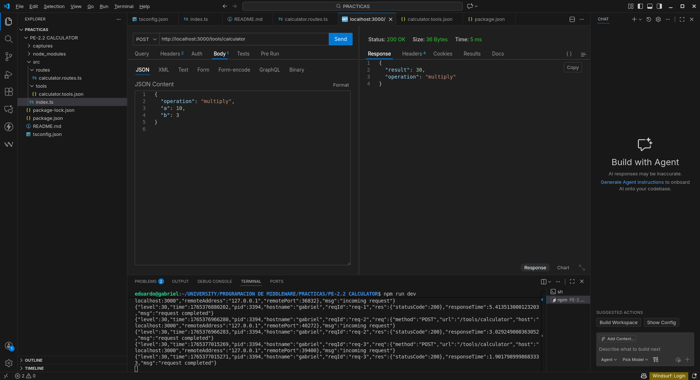

# PE-2.2 – Calculator

Este proyecto implementa un servidor Fastify con un MCP Tool llamado Calculator, el cual permite ejecutar operaciones aritméticas básicas: suma, resta, multiplicación y división.

El servidor estará activo en:

http://localhost:3000

# Swagger UI:

http://localhost:3000/docs

Ejemplo de uso (Thunder Client)
Endpoint:
POST /tools/calculator

Body:
{
  "operation": "add",
  "a": 10,
  "b": 3
}

📸 Capturas de funcionamiento
Operación ADD
 

Operación SUBTRACT
 

Operación MULTIPLY
 

Operación DIVIDE
 

Operación DIVIDE

Error: División para 0
 

Servidor MCP – Vista general
 

Swagger UI funcionando

## Seguridad

La API documenta esquemas de autenticación (API Key y Bearer Token)
como medida preventiva ante ataques de Tool Poisoning. Aunque la
seguridad no se encuentra implementada, su documentación facilita
una futura integración segura.

## Versionado del API

Este proyecto utiliza versionado semántico (SemVer):

- MAJOR: cambios incompatibles con versiones anteriores
- MINOR: nuevas funcionalidades compatibles
- PATCH: correcciones de errores

Versión actual del API: 1.0.0

## Estrategia de evolución

La evolución del API se realizará sin romper clientes existentes,
siguiendo buenas prácticas de diseño de APIs:

- Nuevas operaciones se agregarán como nuevos endpoints o nuevas opciones
  dentro del esquema existente.
- No se modificarán los formatos de respuesta actuales.
- Los cambios incompatibles se introducirán en nuevas versiones mayores
  del API.

## Manejo de errores

La API maneja errores comunes mediante códigos HTTP adecuados:

- 200: operación ejecutada correctamente
- 400: error de validación o lógica (por ejemplo, división por cero)
- 500: error interno del servidor

Los mensajes de error son devueltos en formato JSON.

## Licencia

Este proyecto se distribuye bajo la licencia MIT.

